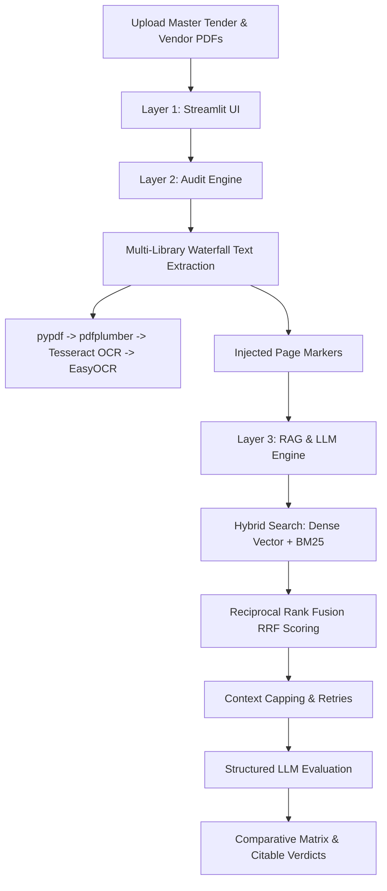

# 📋 IOCL Summer Internship Presentation Guide: Tender Audit & Compliance
**Candidate:** Alokita Dutta  
**Department:** Information Systems (IS), Haldia Refinery  
**Guides:** Mr. Manas Kumar Biswas (General Manager, IS) & Mr. Debabrata Mallick (Manager, IS)

---

## 1. ⚙️ System Workflow: What Happens Under the Hood?
The Argus Bid AI system processes a tender audit using a **three-layer architecture**:

### The Step-by-Step Internal Process:
1. **Text Extraction (Layer 2):** 
   The PDF is passed through a "Waterfall" pipeline. If the PDF has digital text, it uses `pypdf` (fastest). If it has complex tables, it uses `pdfplumber` to reconstruct them as markdown. If it's a scanned image, it runs `Tesseract OCR` or `EasyOCR`. A global thread lock ensures parallel OCR scans do not cause memory crashes.
2. **Chunking & Indexing:** 
   The extracted text has page markers injected (e.g. `--- PAGE 5 ---`). It is divided into chunks using a **Parent-Child Chunking Strategy**: small child chunks (300 characters) are indexed in a local `ChromaDB` vector store for exact searching, while their larger parent chunks (1,000 characters) are retrieved to provide context to the LLM.
3. **Hybrid Search & Fusion:** 
   To find matching clauses, the system queries the vector store using both **Semantic (Dense) Search** and **Keyword (BM25) Search** simultaneously, combining rankings via **Reciprocal Rank Fusion (RRF)**.
4. **Structured Decision (Layer 3):** 
   The retrieved context is capped (max 15,000–16,000 characters) and sent to the LLM (Gemini or Groq) with instructions to output a strict, machine-readable JSON object containing the `verdict` (pass/fail/lacking), `evidence` (exact quotes), and `page` number.

---

## 2. 📊 Comparison: Old Prototype vs. Current Upgraded System

| Feature | Old Prototype | Current Upgraded System (Now) |
| :--- | :--- | :--- |
| **Gemini Integration** | Disabled / Commented out | **Fully Enabled** (supports Gemini 1.5, 2.0, and the new **Gemini 2.5 Flash / Pro**). |
| **API Key Compatibility** | Only worked with older `AIzaSy` keys. Crashed on newer `AQ.` keys. | **Dynamic Header Resolution:** Automatically detects `AQ.` keys and switches to the new Google Bearer token format. |
| **Rate-Limit Handling** | Fragile. Crashed the entire audit on `429` (Too Many Requests) errors. | **Robust Self-Healing:** Increased to 8 retries, exponential backoff, and caps wait delays to prevent crashes. |
| **Payload Size** | Prone to `413 Payload Too Large` crashes on large specification tables. | **Strict Context Capping:** Limits LLM context to 16,000 characters and optimizes parent chunk sizes. |
| **Document Viewer** | Crashed with "File Not Found" if physical PDFs were missing from local cache. | **Page Text Viewer Fallback:** Renders text in-memory page-by-page if physical files are missing. |
| **MSME/Udyam Logic** | Rejected MSME bidders if they lacked an explicit MAF (Manufacturer's Authorization Form). | **Udyam Exemption Rule:** Automatically waives MAF requirements if a valid Udyam registration is detected. |

---

## 3. ❄️ Why is My Local Device Freezing? (Hardware Explanation)
When running the **"Local Llama RAG (Ollama)"** mode, your laptop is running a massive artificial neural network (with 8 Billion parameters) locally on your hardware. 

### Why the freeze happens:
* **CPU Bottleneck:** Running an 8B parameter model on a standard CPU consumes 100% of all processing cores. This starves the operating system, causing your mouse cursor to lag, screen to freeze, and applications to stop responding.
* **RAM Spillage:** Models like Llama 3 8B require at least 14GB of free memory. If your laptop has 8GB or 16GB of RAM, your operating system is forced to swap memory to your hard disk (pagefile), dragging performance to a crawl.
* **Lack of Dedicated GPU:** Standard laptops lack NVIDIA GPUs with dedicated VRAM (8GB+ needed), which are designed to offload these heavy matrix multiplications.

### The Solution:
Present your model using the **Cloud RAG (Gemini)** mode. It offloads 100% of the heavy computations to Google's supercomputers. Your laptop's RAM usage will drop to near zero, and the system will run smoothly and return results in seconds.

---

## 4. 🎯 How to Address "Wrong Data Catching" (LLM Hallucinations)
No AI model is 100% accurate, especially when reading scanned vendor documents with complex layouts. If the AI misses a requirement or classifies a page incorrectly, here is how you explain and solve it:

### Why "Wrong Data" happens:
1. **OCR Noise:** Low-resolution scans or slanted pages result in typos (e.g. "Tender ID: NW-4471" read as "NW-447I").
2. **Context Dilution:** If a vendor merges multiple files (e.g., placing a PAN card on page 14 of an Audited Balance Sheet), the similarity search might retrieve the financial details but miss the PAN card.
3. **JSON Parsing Failures:** The LLM occasionally slips conversational text into the response, causing the parser to fail.

### How We Solve This (Implemented & Recommended):
* **Regex-First Hybrid Engine (Implemented):** We bypass the LLM for straightforward, clear-cut values by running fast regex rules first (e.g., detecting valid GSTIN numbers, extracting Partnership firm identifiers from PAN cards, or validating Tender ID formats). The LLM is only called as a fallback.
* **Few-Shot Prompt Engineering (Implemented):** The system prompts are loaded with strict example structures showing the LLM exactly how to interpret Indian procurement policies (such as NSIC/Udyam EMD waivers).
* **Human-in-the-Loop Override (Recommended):** In production, the system is designed to assist, not replace. If the AI flags a checklist item incorrectly, the procurement officer can click a checkbox to manually override the status and type in a correct remark.
* **Table Transformer models (Future Scope):** Replacing rule-based table extraction with deep-learning vision models (like Microsoft Table-Transformer) to handle non-grid tables cleanly.

---

## 5. 🌟 Why Argus Bid AI is Better Than Other Systems (e.g., ChatGPT)
When presenting to the General Manager, emphasize these key business advantages:

1. **Zero Hardcoded Rules:** Traditional software requires developers to write custom code for every new tender template. Argus Bid AI reads the Master Tender document, dynamically extracts the requirements, and applies them to the vendors—meaning it works out-of-the-box for a Civil tender, an IT tender, or a Chemical tender.
2. **Strict Data Privacy:** Unlike uploading documents to public portals (like ChatGPT), Argus Bid AI keeps all data local. It runs fully offline inside IOCL's local network when using the Ollama GPU server mode.
3. **Evidence-Linked Auditing:** Standard AI tools just give a "Yes" or "No" answer. Argus Bid AI provides **traceable evidence**—for every pass or fail, it quotes the exact document text and links to the specific page number, allowing immediate human verification.
4. **Massive Efficiency Gains:** A human review of a vendor bid package takes **2 to 3 hours**. Argus Bid AI completes the audit in **under 2 minutes**, eliminating human fatigue and oversight.
